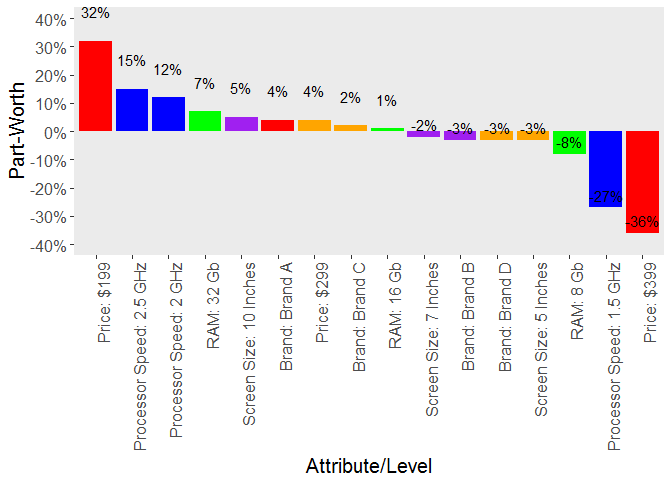

Hierarchical Bayes Choice Study for New Product Assessment
----------------------------------------------------------

The data for this example come from a class in Marketing Analytics I
took in the Predictive Analytics program at Northwestern. Since I can't
use data from my own work, this data is a good stand-in for the types of
new product models I have done over the years. The data originally came
from a survey study doe several years ago (the exact time frame is
unknown) and the specifics of the study (like the brands) have been
masked so there isn't any chance of the data providing any market
insights today.

Originally, the purpose of the study was to identify the optimial new
product configuration for a firm in the computer tablet market. Likely
buyers of tablets participated in a marketing research study and where
presented with an experimentally designed choice taks where they were
asked to choose between a set of 3 possible products. The products on
the choice "card" were described with several attributes, including the
brand, screen size, amount of RAM, processor speed, and price.

There are actually a wide variety of choice models that can be employed
for any particular new product scenario. This particular one is referred
to as a Discrete Choice exercises because respondents were shown
multiple possible products at one time and asked to make a choice of
which one of the 3 they would purchase. There are many design decisions
and trade-offs that need to be made conducting a study of this type.
Since they data are not from a study I conducted, I cannot speak to
those decisions or to the realism of this particular exercise so I'll
use this as an example of the type of work that can be done rather than
as an example of what should be done for this type of question.

### R syntax files I used to generate the material necessary for the repo:

------------------------------------------------------------------------

-   [1 -
    Codeup.R](https://github.com/msheffer2/Hierarchical-Bayes-Choice-Study/blob/master/1%20-%20Codeup.R)
    -- creates the datasets necessary for conducting the analysis,
    including the experimental design file and the raw data containing
    the product choices for respondents in the study.
-   [2 -
    Model.R](https://github.com/msheffer2/Hierarchical-Bayes-Choice-Study/blob/master/2%20-%20Model.R)
    -- the code to conduct the hierarchical Bayesian model, evaluate the
    model, validate the fit, and export the coefficients for
    later analysis.
-   [3 - Post Model
    Analytics.R](https://github.com/msheffer2/Hierarchical-Bayes-Choice-Study/blob/master/3%20-%20Post%20Model%20Analytics.R)
    -- this syntax files takes the model coefficients and generates the
    graphs or datasets for the analytics presented in the readme file.

#### Technical Notes:

-   All of this work should be entirely replicable and should offer a
    pretty good idea of my workflow and how I like to organize my files
    when conducting these types of models.
-   Larger data files have been compressed and split using 7-zip
    for reproducibility.
-   I rarely have generated outputs from this type of study in R. I
    often tend to export my raw data to Excel and generate Excel-based
    outputs for my internal clients. Often, my materials are
    post-processed by other team members to make more polished outputs
    for reporting; in most cases, the critical outputs tend to be the
    future market scenarios and the identificiation of the optimal
    product configurations.
-   I was originally going to produce outputs in this notes section to
    show some of diagnostic steps of performing a Hierarchical Bayesian
    model, including looking for a stable region to pull the betas,
    evaluating that the beta densities of the posterior are normal, and
    validating the model results. I chose to eliminate these outputs
    from this readme file due to length but these steps are described in
    the syntax file [2 -
    Model.R](https://github.com/msheffer2/Hierarchical-Bayes-Choice-Study/blob/master/2%20-%20Model.R)

### Analytical Highlights

------------------------------------------------------------------------

Respondents in this dataset were presented with 36 different scenarios,
each containing product descriptions of 3 tablets to choose from. For
each scenario, the respondent was to choose one of the available
options. From this type of data, it's possible to model preference for
the specific features or attirubes varied in the experimental design
(the framework that established what product configurations are seen in
each scenario). It is appropriate to model discrete choice data, like
the data that comes from this piece of research, using a type of logit
model. In this case, I'm performed a Hiearchcial Bayes Logit model. In
my work, I have tended to prefer Bayesian models to aggregate models in
these situatiosn because they have been shown to be quite good at
recovering coefficients that reflect influencers of choice and they
provide individual-level coefficients that can more accurately capture
individual-level heterogeneity in decision-making processes.

#### Technincal Model Results

------------------------------------------------------------------------

##### Table 1: Log Odds Ratios, Odds Ratio, and % Change in Odds for the Bayesian Logit Model

<table>
<colgroup>
<col width="28%" />
<col width="17%" />
<col width="18%" />
<col width="14%" />
<col width="20%" />
</colgroup>
<thead>
<tr class="header">
<th align="center">Attribute</th>
<th align="center">Level</th>
<th align="center">Log Odds Ratio</th>
<th align="center">Odds Ratio</th>
<th align="center">% Change in Odds</th>
</tr>
</thead>
<tbody>
<tr class="odd">
<td align="center">Screen Size</td>
<td align="center">5 Inches</td>
<td align="center">-0.3</td>
<td align="center">0.74</td>
<td align="center">-0.26</td>
</tr>
<tr class="even">
<td align="center"></td>
<td align="center">7 Inches</td>
<td align="center">-0.16</td>
<td align="center">0.85</td>
<td align="center">-0.15</td>
</tr>
<tr class="odd">
<td align="center"></td>
<td align="center">10 Inches</td>
<td align="center">0.46</td>
<td align="center">1.58</td>
<td align="center">0.58</td>
</tr>
<tr class="even">
<td align="center">RAM</td>
<td align="center">8 Gb</td>
<td align="center">-0.68</td>
<td align="center">0.51</td>
<td align="center">-0.49</td>
</tr>
<tr class="odd">
<td align="center"></td>
<td align="center">16 Gb</td>
<td align="center">0.07</td>
<td align="center">1.07</td>
<td align="center">0.07</td>
</tr>
<tr class="even">
<td align="center"></td>
<td align="center">32 Gb</td>
<td align="center">0.61</td>
<td align="center">1.84</td>
<td align="center">0.84</td>
</tr>
<tr class="odd">
<td align="center">Processor Speed</td>
<td align="center">1.5 GHz</td>
<td align="center">-2.19</td>
<td align="center">0.11</td>
<td align="center">-0.89</td>
</tr>
<tr class="even">
<td align="center"></td>
<td align="center">2 GHz</td>
<td align="center">0.95</td>
<td align="center">2.59</td>
<td align="center">1.59</td>
</tr>
<tr class="odd">
<td align="center"></td>
<td align="center">2.5 GHz</td>
<td align="center">1.24</td>
<td align="center">3.46</td>
<td align="center">2.46</td>
</tr>
<tr class="even">
<td align="center">Price</td>
<td align="center">$199</td>
<td align="center">2.4</td>
<td align="center">11.02</td>
<td align="center">10.02</td>
</tr>
<tr class="odd">
<td align="center"></td>
<td align="center">$299</td>
<td align="center">0.31</td>
<td align="center">1.36</td>
<td align="center">0.36</td>
</tr>
<tr class="even">
<td align="center"></td>
<td align="center">$399</td>
<td align="center">-2.71</td>
<td align="center">0.07</td>
<td align="center">-0.93</td>
</tr>
<tr class="odd">
<td align="center">Brand</td>
<td align="center">Brand A</td>
<td align="center">0.33</td>
<td align="center">1.39</td>
<td align="center">0.39</td>
</tr>
<tr class="even">
<td align="center"></td>
<td align="center">Brand B</td>
<td align="center">-0.22</td>
<td align="center">0.8</td>
<td align="center">-0.2</td>
</tr>
<tr class="odd">
<td align="center"></td>
<td align="center">Brand C</td>
<td align="center">0.15</td>
<td align="center">1.16</td>
<td align="center">0.16</td>
</tr>
<tr class="even">
<td align="center"></td>
<td align="center">Brand D</td>
<td align="center">-0.26</td>
<td align="center">0.77</td>
<td align="center">-0.23</td>
</tr>
<tr class="odd">
<td align="center">Brand * Price Interaction</td>
<td align="center">Brand A * Price</td>
<td align="center">-0.13</td>
<td align="center">0.88</td>
<td align="center">-0.12</td>
</tr>
<tr class="even">
<td align="center"></td>
<td align="center">Brand B * Price</td>
<td align="center">0.09</td>
<td align="center">1.09</td>
<td align="center">0.09</td>
</tr>
<tr class="odd">
<td align="center"></td>
<td align="center">Brand C * Price</td>
<td align="center">0.03</td>
<td align="center">1.03</td>
<td align="center">0.03</td>
</tr>
<tr class="even">
<td align="center"></td>
<td align="center">Brand D * Price</td>
<td align="center">0.01</td>
<td align="center">1.01</td>
<td align="center">0.01</td>
</tr>
</tbody>
</table>

The table above shows the typical technical results from a logit model,
including the log odds ration, the odds ration, and the percent change
in odds. These types of outputs are fine for the data scientist but I
rarely prepare this type of output for a client (either internal or
external). Since logit coefficients are in fact log odds ratios that
describe changes in the log-odds of a product being chosen, they lack
the intuitive understanding I preferr to use when describing model
results. Efforts to convert the log odds ratio into more easily
understandable items like odds rations or percent change in the odds are
also, in my opinion, not inuitive. So while I might look at results like
this, along with other measure of model performance, I tend to prefer a
different type of output when describing model outputs to others.

#### Preferred Model Results

------------------------------------------------------------------------

##### Table 2: Probability a Product Will Be Chosen for Each Attribute & Level

<table style="width:54%;">
<colgroup>
<col width="22%" />
<col width="13%" />
<col width="18%" />
</colgroup>
<thead>
<tr class="header">
<th align="center">Attribute</th>
<th align="center">Level</th>
<th align="center">Probability</th>
</tr>
</thead>
<tbody>
<tr class="odd">
<td align="center">Screen Size</td>
<td align="center">5 Inches</td>
<td align="center">39.6%</td>
</tr>
<tr class="even">
<td align="center"></td>
<td align="center">7 Inches</td>
<td align="center">41.1%</td>
</tr>
<tr class="odd">
<td align="center"></td>
<td align="center">10 Inches</td>
<td align="center">48.1%</td>
</tr>
<tr class="even">
<td align="center">RAM</td>
<td align="center">8 Gb</td>
<td align="center">35.3%</td>
</tr>
<tr class="odd">
<td align="center"></td>
<td align="center">16 Gb</td>
<td align="center">43.7%</td>
</tr>
<tr class="even">
<td align="center"></td>
<td align="center">32 Gb</td>
<td align="center">49.8%</td>
</tr>
<tr class="odd">
<td align="center">Processor Speed</td>
<td align="center">1.5 GHz</td>
<td align="center">16.0%</td>
</tr>
<tr class="even">
<td align="center"></td>
<td align="center">2 GHz</td>
<td align="center">54.6%</td>
</tr>
<tr class="odd">
<td align="center"></td>
<td align="center">2.5 GHz</td>
<td align="center">58.1%</td>
</tr>
<tr class="even">
<td align="center">Price</td>
<td align="center">$199</td>
<td align="center">75.1%</td>
</tr>
<tr class="odd">
<td align="center"></td>
<td align="center">$299</td>
<td align="center">46.5%</td>
</tr>
<tr class="even">
<td align="center"></td>
<td align="center">$399</td>
<td align="center">7.2%</td>
</tr>
<tr class="odd">
<td align="center">Brand</td>
<td align="center">Brand A</td>
<td align="center">46.8%</td>
</tr>
<tr class="even">
<td align="center"></td>
<td align="center">Brand B</td>
<td align="center">40.3%</td>
</tr>
<tr class="odd">
<td align="center"></td>
<td align="center">Brand C</td>
<td align="center">44.6%</td>
</tr>
<tr class="even">
<td align="center"></td>
<td align="center">Brand D</td>
<td align="center">40.0%</td>
</tr>
</tbody>
</table>

Instead of relying on coefficient outputs like those found in Table 1, I
instead run simulations from the model that looks at every possible
combination of products that can be described by the attributes and
levels. I then calculate the probabilty that a product would be chosen
out of a set of 3 typical products, on average when each attribute is
varied (and holding all other features constant).

When I tally the results, I get output that looks like Table 2 above.
The probability column indicates how likely a product is to be chosen
out of a set of 3 random products with all that is varied is the
attribute to the left. For example, the 39.6% for a Screen Size of 5
inches indicates that when everything is held constant, a 5 inch table
has about a 40% chance of being chosen, on average, but a 10 inch screen
table has a 48% probability of being chosen. This indicates that 10 inch
screens are more preferable to 5 inch screen, on average, by about 8%.

The data in Table 2 is a bit more inuitive and, although I'm showing it
in tabular format here, it can be more easily plotted in a variety of
ways. Also note that the model includes an interaction between price and
brand that was shown in Table 1. In table 2, I've chosen to show the
main effects only and to treat the interaction seprately.

##### Figure 1: Interaction of Price & Brand on Probability a Product Will Be Chosen

It's common in some markets, and in consumer electronics particuarly, to
expect that price sensitivity for products will not be uniform across
the brands. In other words, some brands are able to carry a price
premium simply because of its brand equity while others might only ever
be seen as a commodity brand that is penalized strongly for a higher
price.

Figure 1 shows how the probability of a product to be chosen changes
over the range of prices and brands chosen. If there were no affect of
brand on price, then the lines for the 4 brand would be parallel as
price increases. This isn't the case, however. At lower prices, Brands A
and C have a premium over Brands B and D, which are almost
interchangable with each other. As prices increase, however, the effect
of brand starts to diminish to the point where only a small premium is
acceptable from Brands A and C at the highest price assessed. In fact,
at $399, almost all 4 brands become more "replacable" with each other.

It's also notable, though, that any brand at a lower price point has a
higher probability of being chosen than any brand at a higher price
point. For example, Brand A has the highest probability of being chosen
at a price point of $299 but all brands will be more likely to be chosen
if they are at a $199 price point. Overall, this suggests that price is
critical to this market and that it can trump any brand equity in the
market.

#### Attribute Importance

------------------------------------------------------------------------

##### Figure 2: Attribute Importance or the Amount of Variation in Choice Explained by Each Attribute

Typically, describing what product features or attributes are the most
important for a product choice decision is necessary analytically. One
way of measuring Attribute Importance is to measure how much each
attribute can change the probability of choice for a typical product;
attributes that result in large changes in probability in choice are
more important while attributes that result in small changes in
probability are less important. Often, the shifts in probability are
measured as a percent of the total shift in probability possible. Each
attributes shift in probability is then referred to as the amount of
variation (in choice) that can be explained or accounted for by that
particular attribute.

Figure 2 shows just such a graph where each attribute is described by
the proportion of choice probability each induce swhen we measure
product choice with the varying levels available. Figure 2 suggests that
price is the most important attribute in that in can account for almost
half of the variation in product choice based on the range of prices
assesed. Processor Speed accounts for about 30% of the change in product
choice, which might have been a novel finding at the time these data
were new but is probably not an accurate reflection today. Brand has
very little effect on product choice; it only acounts for about 5% of
the variation in product choice.

#### Part-worths Plot

------------------------------------------------------------------------

##### Figure 3: How Each Attribute Level Adds or Subtracts Utility from Product Choice

Part-worths are a rather old-school way of describing the results of a
choice model. Part-worths are usually calculated from the raw model
coefficients and describe the amount of "utility" each level of each
attribute provides to the overall value judgement of the product
configuration. Rather than calculate true part-worths, I prefer to take
the data from Table 2 to create something similar in spirit that allows
for a single snapshot of what's going to happen when you put different
attribute levels together.

Positive part-worths suggest that products with this specific feature
have "positive utility" or are more likely to be chosen, while negative
part-worths suggests that specific features are less likely to be
chosen, all things being equal. When all the part-worths are plotting in
order, a snapshot of the "good" and "bad" aspects of a new possible
producht can be readily assessed in a single snapshot like that shown in
Figure 3.

For example, a product haveing a price of $199 has a 32% greater
probability of being chosen, on average, but a price of $399 for a new
product has a 36% less change of being chosen. Specific levels of
processor speed (2.5 GHz and 2 GHz) increase the probability of being
chosen while a 1.5 GHz process reduces the likelihood of being chosen.
Most of the attribute levels in the middle of the graph do very little
to influence the probability of choice. One of the reasons I like this
type of graph is that the length of the bars and the order of the levels
combine the Attribute Importance information from Figure 2 with the
relative findings from the utilities presented in Table 2.

#### Identifying the Optimal (and Sub-Optimal) Product Configurations

------------------------------------------------------------------------

##### Table 3: Top 5 Most Chosen Product Configurations

<table style="width:79%;">
<colgroup>
<col width="13%" />
<col width="8%" />
<col width="16%" />
<col width="11%" />
<col width="11%" />
<col width="18%" />
</colgroup>
<thead>
<tr class="header">
<th align="center">Screen</th>
<th align="center">RAM</th>
<th align="center">Processor</th>
<th align="center">Price</th>
<th align="center">Brand</th>
<th align="center">Probability</th>
</tr>
</thead>
<tbody>
<tr class="odd">
<td align="center">10 Inches</td>
<td align="center">32 Gb</td>
<td align="center">2.5 GHz</td>
<td align="center">$199</td>
<td align="center">Brand A</td>
<td align="center">98.9%</td>
</tr>
<tr class="even">
<td align="center">10 Inches</td>
<td align="center">32 Gb</td>
<td align="center">2 GHz</td>
<td align="center">$199</td>
<td align="center">Brand A</td>
<td align="center">98.5%</td>
</tr>
<tr class="odd">
<td align="center">10 Inches</td>
<td align="center">32 Gb</td>
<td align="center">2.5 GHz</td>
<td align="center">$199</td>
<td align="center">Brand C</td>
<td align="center">98.4%</td>
</tr>
<tr class="even">
<td align="center">10 Inches</td>
<td align="center">16 Gb</td>
<td align="center">2.5 GHz</td>
<td align="center">$199</td>
<td align="center">Brand A</td>
<td align="center">98.1%</td>
</tr>
<tr class="odd">
<td align="center">7 Inches</td>
<td align="center">32 Gb</td>
<td align="center">2.5 GHz</td>
<td align="center">$199</td>
<td align="center">Brand A</td>
<td align="center">97.9%</td>
</tr>
</tbody>
</table>

The strength of developing choice models is that it allows the data
scientist to model any possible combination of attribute and level
assessed regardless of if the specific configuration was actually seen
by anyone. I often run all possible combinations of products and then
rank order the results in order to identify the best and worst possible
configurations. Table 3 shows the top 5 products with the highest
probabiliyt of being chosen. The first product configuration (Brand A
tablet with 10 in screen, 32 Gb RAM, 2.5 GHz Processor, and priced at
$199) is the product predicted to be most often chosen (approximately
99% of the time). But the table also suggests that 10 inch products from
Brand A and priced at $199 are often top performers so there is some
room to manipulate the product offering if other marketing factors are
important to the decision.

##### Table 4: Bottom 5 Least Chosen Product Configurations

<table style="width:78%;">
<colgroup>
<col width="12%" />
<col width="8%" />
<col width="16%" />
<col width="11%" />
<col width="11%" />
<col width="18%" />
</colgroup>
<thead>
<tr class="header">
<th align="center">Screen</th>
<th align="center">RAM</th>
<th align="center">Processor</th>
<th align="center">Price</th>
<th align="center">Brand</th>
<th align="center">Probability</th>
</tr>
</thead>
<tbody>
<tr class="odd">
<td align="center">5 Inches</td>
<td align="center">8 Gb</td>
<td align="center">1.5 GHz</td>
<td align="center">$399</td>
<td align="center">Brand B</td>
<td align="center">0.1%</td>
</tr>
<tr class="even">
<td align="center">7 Inches</td>
<td align="center">8 Gb</td>
<td align="center">1.5 GHz</td>
<td align="center">$399</td>
<td align="center">Brand B</td>
<td align="center">0.1%</td>
</tr>
<tr class="odd">
<td align="center">5 Inches</td>
<td align="center">8 Gb</td>
<td align="center">1.5 GHz</td>
<td align="center">$399</td>
<td align="center">Brand D</td>
<td align="center">0.1%</td>
</tr>
<tr class="even">
<td align="center">7 Inches</td>
<td align="center">8 Gb</td>
<td align="center">1.5 GHz</td>
<td align="center">$399</td>
<td align="center">Brand D</td>
<td align="center">0.1%</td>
</tr>
<tr class="odd">
<td align="center">5 Inches</td>
<td align="center">8 Gb</td>
<td align="center">1.5 GHz</td>
<td align="center">$399</td>
<td align="center">Brand A</td>
<td align="center">0.2%</td>
</tr>
</tbody>
</table>

Conversely, Table 4 shows the 5 worst product configurations predicted
by the model. The first product configuration (Brand B table with 5 in
screen, 8 Gb RAM, 1.5 GHz Processor, and priced at $399) is the product
predicted to be least often chosen (approximately 0% of the time).
Unlike the Top 5, there's isn't a strong Brand trend but often the
products are priced high (at $399) and have small screens and low RAM.

#### Predicting Preference Share for Possible Market Scenarios

------------------------------------------------------------------------

##### Table 5: Market Scenario \#1 - Large Tablets Market Scenario

<table style="width:69%;">
<colgroup>
<col width="23%" />
<col width="15%" />
<col width="15%" />
<col width="15%" />
</colgroup>
<thead>
<tr class="header">
<th align="center">Attribute</th>
<th align="center">Choice 1</th>
<th align="center">Choice 2</th>
<th align="center">Choice 3</th>
</tr>
</thead>
<tbody>
<tr class="odd">
<td align="center">Brand</td>
<td align="center">B</td>
<td align="center">A</td>
<td align="center">C</td>
</tr>
<tr class="even">
<td align="center">Screen</td>
<td align="center">10 in.</td>
<td align="center">10 in.</td>
<td align="center">10 in.</td>
</tr>
<tr class="odd">
<td align="center">RAM</td>
<td align="center">32 Gb</td>
<td align="center">8 Gb</td>
<td align="center">16 Gb</td>
</tr>
<tr class="even">
<td align="center">Processor</td>
<td align="center">2 GHz</td>
<td align="center">2 GHz</td>
<td align="center">2 GHz</td>
</tr>
<tr class="odd">
<td align="center">Price</td>
<td align="center">$199</td>
<td align="center">$199</td>
<td align="center">$199</td>
</tr>
<tr class="even">
<td align="center">Preference Share</td>
<td align="center">8.6%</td>
<td align="center">64.6%</td>
<td align="center">26.8%</td>
</tr>
</tbody>
</table>

Another extension of the power of the model to predict any combination
of products is to simulate possible future market scenarios. In the
class from which the data originally come, there were two additional
scenarios that were to be predictived as if they represented possible
scenarios of interest to the client. This is actually quite common and
choice studies offer the oppportunity to conduct "what-if" scenarios to
assess posssible future outcomes. In the first scenario, the client was
intersting in what they thought was a reasonable market scenario with
only 3 players in the "large" tablet market.

The "client" was to be Brand A and the product configurations in the
first market scenario represented the clients best guess about what was
likely to be available to the market at launch. Table 5 indicates that
if market scenario 1 occurs, the client's brand should garner the
majority of share in the market (~65%) should there be a large tablet
market with relatively similar capabilities and low prices.

##### Table 6: Market Scenario \#2 - Small Tablets Market Scenario

<table style="width:69%;">
<colgroup>
<col width="23%" />
<col width="15%" />
<col width="15%" />
<col width="15%" />
</colgroup>
<thead>
<tr class="header">
<th align="center">Attribute</th>
<th align="center">Choice 1</th>
<th align="center">Choice 2</th>
<th align="center">Choice 3</th>
</tr>
</thead>
<tbody>
<tr class="odd">
<td align="center">Brand</td>
<td align="center">B</td>
<td align="center">A</td>
<td align="center">C</td>
</tr>
<tr class="even">
<td align="center">Screen</td>
<td align="center">5 in.</td>
<td align="center">5 in.</td>
<td align="center">7 in.</td>
</tr>
<tr class="odd">
<td align="center">RAM</td>
<td align="center">8 Gb</td>
<td align="center">16 Gb</td>
<td align="center">16 Gb</td>
</tr>
<tr class="even">
<td align="center">Processor</td>
<td align="center">1.5 GHz</td>
<td align="center">1.5 GHz</td>
<td align="center">1.5 GHz</td>
</tr>
<tr class="odd">
<td align="center">Price</td>
<td align="center">$199</td>
<td align="center">$199</td>
<td align="center">$399</td>
</tr>
<tr class="even">
<td align="center">Preference Share</td>
<td align="center">49.2%</td>
<td align="center">50.2%</td>
<td align="center">0.5%</td>
</tr>
</tbody>
</table>

Table 6 offers a second "client scenario" but this time in the "small
tablet" market space. Assuming the client was correct in that these
would be the configurations for the 3 players in the market, their brand
(A) would get about 50% of the market share, however, Brand B would be a
strong competitor. It's likely that this scenario is determined most
strongly by Brand C's decision to price expensively which, as we know,
does the most to reduce the likelhiood that a product is chosen.
