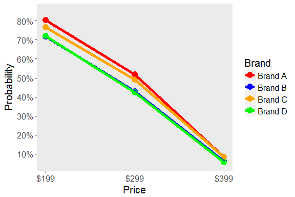

Hierarchical Bayes Choice Study for New Product Assessment
----------------------------------------------------------

Background info

### Analytical Highlights

Possible intro

#### Technincal Model Results

##### TABLE TITLE

<table style="width:99%;">
<caption>Table continues below</caption>
<colgroup>
<col width="36%" />
<col width="22%" />
<col width="23%" />
<col width="16%" />
</colgroup>
<thead>
<tr class="header">
<th align="center">Attribute</th>
<th align="center">Level</th>
<th align="center">Log Odds Ratio</th>
<th align="center">Odds Ratio</th>
</tr>
</thead>
<tbody>
<tr class="odd">
<td align="center">Screen Size</td>
<td align="center">5 Inches</td>
<td align="center">-0.3</td>
<td align="center">0.74</td>
</tr>
<tr class="even">
<td align="center"></td>
<td align="center">7 Inches</td>
<td align="center">-0.16</td>
<td align="center">0.85</td>
</tr>
<tr class="odd">
<td align="center"></td>
<td align="center">10 Inches</td>
<td align="center">0.46</td>
<td align="center">1.58</td>
</tr>
<tr class="even">
<td align="center">RAM</td>
<td align="center">8 Gb</td>
<td align="center">-0.68</td>
<td align="center">0.51</td>
</tr>
<tr class="odd">
<td align="center"></td>
<td align="center">16 Gb</td>
<td align="center">0.07</td>
<td align="center">1.07</td>
</tr>
<tr class="even">
<td align="center"></td>
<td align="center">32 Gb</td>
<td align="center">0.61</td>
<td align="center">1.84</td>
</tr>
<tr class="odd">
<td align="center">Processor Speed</td>
<td align="center">1.5 GHz</td>
<td align="center">-2.19</td>
<td align="center">0.11</td>
</tr>
<tr class="even">
<td align="center"></td>
<td align="center">2 GHz</td>
<td align="center">0.95</td>
<td align="center">2.59</td>
</tr>
<tr class="odd">
<td align="center"></td>
<td align="center">2.5 GHz</td>
<td align="center">1.24</td>
<td align="center">3.46</td>
</tr>
<tr class="even">
<td align="center">Price</td>
<td align="center">$199</td>
<td align="center">2.4</td>
<td align="center">11.02</td>
</tr>
<tr class="odd">
<td align="center"></td>
<td align="center">$299</td>
<td align="center">0.31</td>
<td align="center">1.36</td>
</tr>
<tr class="even">
<td align="center"></td>
<td align="center">$399</td>
<td align="center">-2.71</td>
<td align="center">0.07</td>
</tr>
<tr class="odd">
<td align="center">Brand</td>
<td align="center">Brand A</td>
<td align="center">0.33</td>
<td align="center">1.39</td>
</tr>
<tr class="even">
<td align="center"></td>
<td align="center">Brand B</td>
<td align="center">-0.22</td>
<td align="center">0.8</td>
</tr>
<tr class="odd">
<td align="center"></td>
<td align="center">Brand C</td>
<td align="center">0.15</td>
<td align="center">1.16</td>
</tr>
<tr class="even">
<td align="center"></td>
<td align="center">Brand D</td>
<td align="center">-0.26</td>
<td align="center">0.77</td>
</tr>
<tr class="odd">
<td align="center">Brand * Price Interaction</td>
<td align="center">Brand A * Price</td>
<td align="center">-0.13</td>
<td align="center">0.88</td>
</tr>
<tr class="even">
<td align="center"></td>
<td align="center">Brand B * Price</td>
<td align="center">0.09</td>
<td align="center">1.09</td>
</tr>
<tr class="odd">
<td align="center"></td>
<td align="center">Brand C * Price</td>
<td align="center">0.03</td>
<td align="center">1.03</td>
</tr>
<tr class="even">
<td align="center"></td>
<td align="center">Brand D * Price</td>
<td align="center">0.01</td>
<td align="center">1.01</td>
</tr>
</tbody>
</table>

<table style="width:25%;">
<colgroup>
<col width="25%" />
</colgroup>
<thead>
<tr class="header">
<th align="center">% Change in Odds</th>
</tr>
</thead>
<tbody>
<tr class="odd">
<td align="center">-0.26</td>
</tr>
<tr class="even">
<td align="center">-0.15</td>
</tr>
<tr class="odd">
<td align="center">0.58</td>
</tr>
<tr class="even">
<td align="center">-0.49</td>
</tr>
<tr class="odd">
<td align="center">0.07</td>
</tr>
<tr class="even">
<td align="center">0.84</td>
</tr>
<tr class="odd">
<td align="center">-0.89</td>
</tr>
<tr class="even">
<td align="center">1.59</td>
</tr>
<tr class="odd">
<td align="center">2.46</td>
</tr>
<tr class="even">
<td align="center">10.02</td>
</tr>
<tr class="odd">
<td align="center">0.36</td>
</tr>
<tr class="even">
<td align="center">-0.93</td>
</tr>
<tr class="odd">
<td align="center">0.39</td>
</tr>
<tr class="even">
<td align="center">-0.2</td>
</tr>
<tr class="odd">
<td align="center">0.16</td>
</tr>
<tr class="even">
<td align="center">-0.23</td>
</tr>
<tr class="odd">
<td align="center">-0.12</td>
</tr>
<tr class="even">
<td align="center">0.09</td>
</tr>
<tr class="odd">
<td align="center">0.03</td>
</tr>
<tr class="even">
<td align="center">0.01</td>
</tr>
</tbody>
</table>

Explain the table

#### Preferred Model Results

##### TABLE TITLE

<table style="width:54%;">
<colgroup>
<col width="22%" />
<col width="13%" />
<col width="18%" />
</colgroup>
<thead>
<tr class="header">
<th align="center">Attribute</th>
<th align="center">Level</th>
<th align="center">Probability</th>
</tr>
</thead>
<tbody>
<tr class="odd">
<td align="center">Screen Size</td>
<td align="center">5 Inches</td>
<td align="center">39.6%</td>
</tr>
<tr class="even">
<td align="center"></td>
<td align="center">7 Inches</td>
<td align="center">41.1%</td>
</tr>
<tr class="odd">
<td align="center"></td>
<td align="center">10 Inches</td>
<td align="center">48.1%</td>
</tr>
<tr class="even">
<td align="center">RAM</td>
<td align="center">8 Gb</td>
<td align="center">35.3%</td>
</tr>
<tr class="odd">
<td align="center"></td>
<td align="center">16 Gb</td>
<td align="center">43.7%</td>
</tr>
<tr class="even">
<td align="center"></td>
<td align="center">32 Gb</td>
<td align="center">49.8%</td>
</tr>
<tr class="odd">
<td align="center">Processor Speed</td>
<td align="center">1.5 GHz</td>
<td align="center">16.0%</td>
</tr>
<tr class="even">
<td align="center"></td>
<td align="center">2 GHz</td>
<td align="center">54.6%</td>
</tr>
<tr class="odd">
<td align="center"></td>
<td align="center">2.5 GHz</td>
<td align="center">58.1%</td>
</tr>
<tr class="even">
<td align="center">Price</td>
<td align="center">$199</td>
<td align="center">75.1%</td>
</tr>
<tr class="odd">
<td align="center"></td>
<td align="center">$299</td>
<td align="center">46.5%</td>
</tr>
<tr class="even">
<td align="center"></td>
<td align="center">$399</td>
<td align="center">7.2%</td>
</tr>
<tr class="odd">
<td align="center">Brand</td>
<td align="center">Brand A</td>
<td align="center">46.8%</td>
</tr>
<tr class="even">
<td align="center"></td>
<td align="center">Brand B</td>
<td align="center">40.3%</td>
</tr>
<tr class="odd">
<td align="center"></td>
<td align="center">Brand C</td>
<td align="center">44.6%</td>
</tr>
<tr class="even">
<td align="center"></td>
<td align="center">Brand D</td>
<td align="center">40.0%</td>
</tr>
</tbody>
</table>

Explain the table

##### PLOT TITLE

Explain the plot

#### Attribute Importance

##### PLOT TITLE

Explain the plot

#### Part-worths Plot

##### PLOT TITLE

Explain the plot

#### Identifying the Optimal (and Sub-Optimal) Product Configurations

##### TABLE TITLE

<table style="width:79%;">
<colgroup>
<col width="13%" />
<col width="8%" />
<col width="16%" />
<col width="11%" />
<col width="11%" />
<col width="18%" />
</colgroup>
<thead>
<tr class="header">
<th align="center">Screen</th>
<th align="center">RAM</th>
<th align="center">Processor</th>
<th align="center">Price</th>
<th align="center">Brand</th>
<th align="center">Probability</th>
</tr>
</thead>
<tbody>
<tr class="odd">
<td align="center">10 Inches</td>
<td align="center">32 Gb</td>
<td align="center">2.5 GHz</td>
<td align="center">$199</td>
<td align="center">Brand A</td>
<td align="center">98.9%</td>
</tr>
<tr class="even">
<td align="center">10 Inches</td>
<td align="center">32 Gb</td>
<td align="center">2 GHz</td>
<td align="center">$199</td>
<td align="center">Brand A</td>
<td align="center">98.5%</td>
</tr>
<tr class="odd">
<td align="center">10 Inches</td>
<td align="center">32 Gb</td>
<td align="center">2.5 GHz</td>
<td align="center">$199</td>
<td align="center">Brand C</td>
<td align="center">98.4%</td>
</tr>
<tr class="even">
<td align="center">10 Inches</td>
<td align="center">16 Gb</td>
<td align="center">2.5 GHz</td>
<td align="center">$199</td>
<td align="center">Brand A</td>
<td align="center">98.1%</td>
</tr>
<tr class="odd">
<td align="center">7 Inches</td>
<td align="center">32 Gb</td>
<td align="center">2.5 GHz</td>
<td align="center">$199</td>
<td align="center">Brand A</td>
<td align="center">97.9%</td>
</tr>
<tr class="even">
<td align="center">10 Inches</td>
<td align="center">32 Gb</td>
<td align="center">2 GHz</td>
<td align="center">$199</td>
<td align="center">Brand C</td>
<td align="center">97.9%</td>
</tr>
<tr class="odd">
<td align="center">10 Inches</td>
<td align="center">32 Gb</td>
<td align="center">2.5 GHz</td>
<td align="center">$199</td>
<td align="center">Brand D</td>
<td align="center">97.7%</td>
</tr>
<tr class="even">
<td align="center">5 Inches</td>
<td align="center">32 Gb</td>
<td align="center">2.5 GHz</td>
<td align="center">$199</td>
<td align="center">Brand A</td>
<td align="center">97.6%</td>
</tr>
<tr class="odd">
<td align="center">10 Inches</td>
<td align="center">32 Gb</td>
<td align="center">2.5 GHz</td>
<td align="center">$199</td>
<td align="center">Brand B</td>
<td align="center">97.6%</td>
</tr>
<tr class="even">
<td align="center">10 Inches</td>
<td align="center">16 Gb</td>
<td align="center">2 GHz</td>
<td align="center">$199</td>
<td align="center">Brand A</td>
<td align="center">97.5%</td>
</tr>
</tbody>
</table>

<table style="width:79%;">
<colgroup>
<col width="13%" />
<col width="8%" />
<col width="16%" />
<col width="11%" />
<col width="11%" />
<col width="18%" />
</colgroup>
<thead>
<tr class="header">
<th align="center">Screen</th>
<th align="center">RAM</th>
<th align="center">Processor</th>
<th align="center">Price</th>
<th align="center">Brand</th>
<th align="center">Probability</th>
</tr>
</thead>
<tbody>
<tr class="odd">
<td align="center">5 Inches</td>
<td align="center">8 Gb</td>
<td align="center">1.5 GHz</td>
<td align="center">$399</td>
<td align="center">Brand B</td>
<td align="center">0.1%</td>
</tr>
<tr class="even">
<td align="center">7 Inches</td>
<td align="center">8 Gb</td>
<td align="center">1.5 GHz</td>
<td align="center">$399</td>
<td align="center">Brand B</td>
<td align="center">0.1%</td>
</tr>
<tr class="odd">
<td align="center">5 Inches</td>
<td align="center">8 Gb</td>
<td align="center">1.5 GHz</td>
<td align="center">$399</td>
<td align="center">Brand D</td>
<td align="center">0.1%</td>
</tr>
<tr class="even">
<td align="center">7 Inches</td>
<td align="center">8 Gb</td>
<td align="center">1.5 GHz</td>
<td align="center">$399</td>
<td align="center">Brand D</td>
<td align="center">0.1%</td>
</tr>
<tr class="odd">
<td align="center">5 Inches</td>
<td align="center">8 Gb</td>
<td align="center">1.5 GHz</td>
<td align="center">$399</td>
<td align="center">Brand A</td>
<td align="center">0.2%</td>
</tr>
<tr class="even">
<td align="center">7 Inches</td>
<td align="center">8 Gb</td>
<td align="center">1.5 GHz</td>
<td align="center">$399</td>
<td align="center">Brand A</td>
<td align="center">0.2%</td>
</tr>
<tr class="odd">
<td align="center">5 Inches</td>
<td align="center">8 Gb</td>
<td align="center">1.5 GHz</td>
<td align="center">$399</td>
<td align="center">Brand C</td>
<td align="center">0.2%</td>
</tr>
<tr class="even">
<td align="center">7 Inches</td>
<td align="center">8 Gb</td>
<td align="center">1.5 GHz</td>
<td align="center">$399</td>
<td align="center">Brand C</td>
<td align="center">0.2%</td>
</tr>
<tr class="odd">
<td align="center">10 Inches</td>
<td align="center">8 Gb</td>
<td align="center">1.5 GHz</td>
<td align="center">$399</td>
<td align="center">Brand D</td>
<td align="center">0.2%</td>
</tr>
<tr class="even">
<td align="center">5 Inches</td>
<td align="center">16 Gb</td>
<td align="center">1.5 GHz</td>
<td align="center">$399</td>
<td align="center">Brand D</td>
<td align="center">0.2%</td>
</tr>
</tbody>
</table>

Explain the table

#### Predicting Preference Share for Possible Market Scenarios

##### TABLE TITLE

<table style="width:69%;">
<colgroup>
<col width="23%" />
<col width="15%" />
<col width="15%" />
<col width="15%" />
</colgroup>
<thead>
<tr class="header">
<th align="center">Attribute</th>
<th align="center">Choice 1</th>
<th align="center">Choice 2</th>
<th align="center">Choice 3</th>
</tr>
</thead>
<tbody>
<tr class="odd">
<td align="center">Brand</td>
<td align="center">B</td>
<td align="center">A</td>
<td align="center">C</td>
</tr>
<tr class="even">
<td align="center">Screen</td>
<td align="center">10 in.</td>
<td align="center">10 in.</td>
<td align="center">10 in.</td>
</tr>
<tr class="odd">
<td align="center">RAM</td>
<td align="center">32 Gb</td>
<td align="center">8 Gb</td>
<td align="center">16 Gb</td>
</tr>
<tr class="even">
<td align="center">Processor</td>
<td align="center">2 GHz</td>
<td align="center">2 GHz</td>
<td align="center">2 GHz</td>
</tr>
<tr class="odd">
<td align="center">Price</td>
<td align="center">$199</td>
<td align="center">$199</td>
<td align="center">$199</td>
</tr>
<tr class="even">
<td align="center">Preference Share</td>
<td align="center">8.6%</td>
<td align="center">64.6%</td>
<td align="center">26.8%</td>
</tr>
</tbody>
</table>

<table style="width:69%;">
<colgroup>
<col width="23%" />
<col width="15%" />
<col width="15%" />
<col width="15%" />
</colgroup>
<thead>
<tr class="header">
<th align="center">Attribute</th>
<th align="center">Choice 1</th>
<th align="center">Choice 2</th>
<th align="center">Choice 3</th>
</tr>
</thead>
<tbody>
<tr class="odd">
<td align="center">Brand</td>
<td align="center">B</td>
<td align="center">A</td>
<td align="center">C</td>
</tr>
<tr class="even">
<td align="center">Screen</td>
<td align="center">5 in.</td>
<td align="center">5 in.</td>
<td align="center">7 in.</td>
</tr>
<tr class="odd">
<td align="center">RAM</td>
<td align="center">8 Gb</td>
<td align="center">16 Gb</td>
<td align="center">16 Gb</td>
</tr>
<tr class="even">
<td align="center">Processor</td>
<td align="center">1.5 GHz</td>
<td align="center">1.5 GHz</td>
<td align="center">1.5 GHz</td>
</tr>
<tr class="odd">
<td align="center">Price</td>
<td align="center">$199</td>
<td align="center">$199</td>
<td align="center">$399</td>
</tr>
<tr class="even">
<td align="center">Preference Share</td>
<td align="center">49.2%</td>
<td align="center">50.2%</td>
<td align="center">0.5%</td>
</tr>
</tbody>
</table>

Explain the table

### R syntax files I used to generate the material necessary for the report, including:

-   [1 -
    Codeup.R](https://github.com/msheffer2/Data-Science-Specialization/blob/master/01%20-%20Codeup.R)
    -- creates the datasets necessary for conducting the analysis,
    including the experimental design file and the raw data containing
    the product choices for respondents in the study.
-   [2 -
    Model.R](https://github.com/msheffer2/Data-Science-Specialization/blob/master/02%20-%20Building%20the%20DTM.R)
    -- the code to conduct the hierarchical Bayesian model, evaluate the
    model, validate the fit, and export the coefficients for
    later analysis.
-   [3 - Post Model
    Analytics.R](https://github.com/msheffer2/Data-Science-Specialization/blob/master/03%20-%20EDA.R)
    -- this syntax files takes the model coefficients and generates the
    graphs or datasets for the analytics presented in the readme file.

#### Technical Notes:

This section will describe two necessary steps when conducting a
Hierarchical Baysian model:  
\* Looking for a stable region to pull the betas \* Evaluating that the
beta densities of the posterior are normal \* Validating the model
results

#### Finding a stable region to pull the betas

TEXT HERE

#### Evaluating beta densities

TEXT HERE

#### Validating the model results

TEXT HERE
